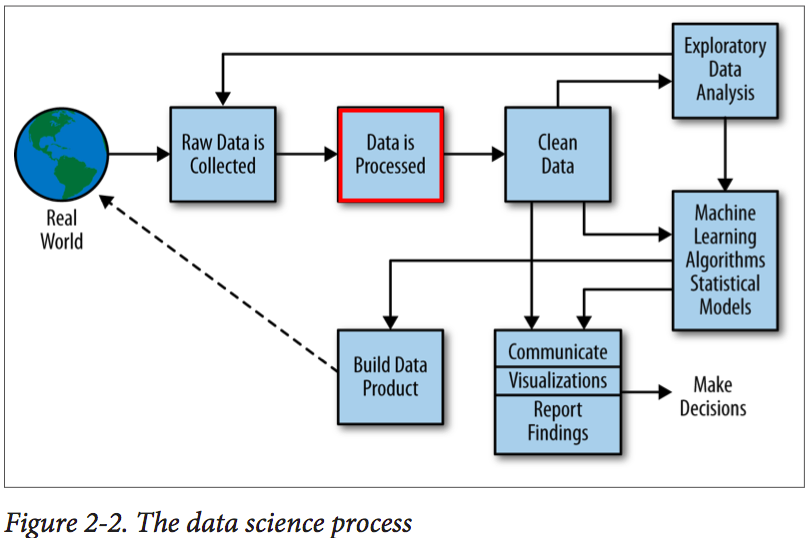

```{r setup, include=FALSE, cache=FALSE}
# Set global R options
options(htmltools.dir.version = FALSE, servr.daemon = TRUE)

# Set global knitr chunk options
knitr::opts_chunk$set(
  fig.align = "center", 
  cache = TRUE,
  error = FALSE,
  message = FALSE, 
  warning = FALSE, 
  collapse = TRUE 
)

# set ggplot to black and white theme
library(ggplot2)
theme_set(theme_bw())
```

```{r, echo=FALSE}
# Configurando reticulate
library(reticulate)
reticulate::use_python("/home/felipe/anaconda3/bin/python")
```

class: title-slide   
<a href="https://github.com/dataAt/intro-analise-de-dados-apresentacao" class="github-corner" aria-label="Código no Github"><svg width="80" height="80" viewBox="0 0 250 250" style="fill:#fff; color:#151513; position: absolute; top: 0; border: 0; right: 0;" aria-hidden="true"><path d="M0,0 L115,115 L130,115 L142,142 L250,250 L250,0 Z"></path><path d="M128.3,109.0 C113.8,99.7 119.0,89.6 119.0,89.6 C122.0,82.7 120.5,78.6 120.5,78.6 C119.2,72.0 123.4,76.3 123.4,76.3 C127.3,80.9 125.5,87.3 125.5,87.3 C122.9,97.6 130.6,101.9 134.4,103.2" fill="currentColor" style="transform-origin: 130px 106px;" class="octo-arm"></path><path d="M115.0,115.0 C114.9,115.1 118.7,116.5 119.8,115.4 L133.7,101.6 C136.9,99.2 139.9,98.4 142.2,98.6 C133.8,88.0 127.5,74.4 143.8,58.0 C148.5,53.4 154.0,51.2 159.7,51.0 C160.3,49.4 163.2,43.6 171.4,40.1 C171.4,40.1 176.1,42.5 178.8,56.2 C183.1,58.6 187.2,61.8 190.9,65.4 C194.5,69.0 197.7,73.2 200.1,77.6 C213.8,80.2 216.3,84.9 216.3,84.9 C212.7,93.1 206.9,96.0 205.4,96.6 C205.1,102.4 203.0,107.8 198.3,112.5 C181.9,128.9 168.3,122.5 157.7,114.1 C157.9,116.9 156.7,120.9 152.7,124.9 L141.0,136.5 C139.8,137.7 141.6,141.9 141.8,141.8 Z" fill="currentColor" class="octo-body"></path></svg></a><style>.github-corner:hover .octo-arm{animation:octocat-wave 560ms ease-in-out}@keyframes octocat-wave{0%,100%{transform:rotate(0)}20%,60%{transform:rotate(-25deg)}40%,80%{transform:rotate(10deg)}}@media (max-width:500px){.github-corner:hover .octo-arm{animation:none}.github-corner .octo-arm{animation:octocat-wave 560ms ease-in-out}}</style>

<br><br><br><br>
# .font200[Introdução à análise de dados com R] 

### Felipe Carvalho & Felipe Menino
### Janeiro 2020

---
# Agenda

- Revisão da linguagem R `r anicon::faa("r-project", animate = 'float', speed = 'slow', color = 'steelblue')`

<br>

- Pacote Tidyverse `r anicon::cia("./img/2_r_img/logo_tidyverse_menor.png", animate = 'float', speed = 'slow')`

<br>

- Visualização de dados `r anicon::cia("./img/2_r_img/ggplot2_logo_menor.jpeg", animate = 'float', speed = 'slow')`

<br>

<!-- Inicio da parte do R-->

---

class: title-slide

<br><br><br>
.center.font300[Revisão da linguagem .bold[R]]
---

# História do R

.font120[
**R** é uma linguagem de programação de alto nível com ambiente voltado para visualização e análise de dados. Em essência foi inspirada na linguagem de programação **S**. Foi iniciamente escrita por **R**oss Ihaka e **R**obert Gentleman no departamento de estatística da universidade de Auckland.
]

.pull-left[

```{r fig2, echo=FALSE, out.height="50%", out.width="50%"}
knitr::include_graphics("./img/2_r_img/robert_gentleman.jpg")
```

.center.font70[Robert Gentleman]

]

.pull-right[

```{r fig1, echo=FALSE, out.height="45%", out.width="45%"}

```

.center.font70[Ross Ihaka]

]

---

# Conceitos básicos

## Atribuimos valor usando uma seta .bold[`<-`] apontada para a variável

<br>


.pull-left[

.center.font100[Declaração de variáveis]

```{r, fig.height=4}
  inteiro <- 321L

  numerico <- 123
  
  complexo <- 321i
  
  booleano <- TRUE 
  
  caractere <- "Bem-vindos"

``` 

]

--
.pull-right[
.center.font100[Acessando os valores]

```{r, fig.height=4}
  print(numerico)

  caractere
```
]


---

# Tipos de dados estruturados

### Podemos declarar um vetor usando .bold[`c()`] e uma lista usando .bold[`list()`]

.pull-left[

.center.font100[Vetores]

```{r, fig.height=4}
  vetor_int <-   c(1, 3, 5)

  vetor_char <- c("teste", "teste", "teste")
  
  vetor_bool <- c(TRUE, TRUE, FALSE)
``` 


```{r, fig.height=5}
  vetor_int
``` 

]

.pull-right[

.center.font100[Listas]

```{r, fig.height=5}
  lista_int <-   list(1, 3, 5)

  lista_lista <- list(1, 2.3, list("tres"))
``` 


```{r, fig.height=5, cache=FALSE}
  lista_lista
``` 

]

---

# Qual é a diferença?

--

.pull-left[

.bold[Vetores são atômicos, só aceitam um tipo]

```{r, fig.height=5}
  vetor_diferente <- c(1, 2.5, TRUE, "ola")
  
  vetor_diferente
```

```{r, fig.height=5}
  is.atomic(vetor_diferente)
```

]

.pull-right[

.bold[Lista não são atômicas, aceitam diversos tipos:]

```{r, fig.height=5}
  lista_diferente <- list(1, TRUE, "ola")
  lista_diferente
```

```{r, fig.height=5}
  is.atomic(lista_diferente)
```
]

---

# Pense em vetores!

Todos os tipos primitivos em R são tratados como vetores:

.pull-left[

```{r, fig.height=5}
  lista <- list(1, 2, list("ola", FALSE))

  lista
```

]

--

.pull-right[

.center.font100[Será lista?]

```{r, fig.height=5}
  is.list(lista)
```

.center.font100[Será vetor?]

```{r, fig.height=5}
  is.vector(lista[[3]][[2]])
```

.center.font100[Será vetor?]

```{r, fig.height=5}
  is.vector(42)
```

]
---

# Hierarquia de tipo primitivos

### O .bold[R] possui uma conversão de tipos, sendo assim, garantindo que todo vetor seja atômico.

.center[
```{r fig3, echo=FALSE, out.height="80%", out.width="80%"}
knitr::include_graphics("./img/2_r_img/tipos.png")
```
R 4 Data Science - Hadley
]


---

# Hierarquia de tipo primitivos

.pull-left[
#### Os tipos mais fortes são:
.blue[
1. character
2. complex
3. numeric
4. logical]
]


.pull-right[
#### Conversão:

```{r}
v1 <- c(FALSE, "tipo", 5)
```
]

---

# Hierarquia de tipo primitivos

.pull-left[
#### Os tipos mais fortes são:
.blue[
1. character
2. complex
3. numeric
4. logical]
]


.pull-right[
#### Conversão:

```{r}
v1 <- c(FALSE, "tipo", 5)
v1
```
]


---

# Hierarquia de tipo primitivos

.pull-left[
#### Os tipos mais fortes são:
.blue[
1. character
2. complex
3. numeric
4. logical]
]


.pull-right[
#### Conversão:

```{r}
v1 <- c(FALSE, "tipo", 5)
v1
```

```{r}
v2 <- c(32, 1, 5i)
```

]

---

# Hierarquia de tipo primitivos

.pull-left[
#### Os tipos mais fortes são:
.blue[
1. character
2. complex
3. numeric
4. logical]
]


.pull-right[
#### Conversão:

```{r}
v1 <- c(FALSE, "tipo", 5)
v1
```

```{r}
v2 <- c(32, 1, 5i)
v2
```
]


---

# Hierarquia de tipo primitivos

.pull-left[
#### Os tipos mais fortes são:
.blue[
1. character
2. complex
3. numeric
4. logical]
]


.pull-right[
#### Conversão:

```{r}
v1 <- c(FALSE, "tipo", 5)
v1
```

```{r}
v2 <- c(32, 1, 5i)
v2
```

#### Tipos:
```{r}
typeof(v1)
```

```{r}
typeof(v2)
```
]

---
# Data Frame

Matriz composta por linhas e colunas, cujas colunas representam as variáveis (atributos) e as linhas representam observações

<br>

.center[
```{r fig311, echo=FALSE, out.height="60%", out.width="60%"}
knitr::include_graphics("./img/2_r_img/df_definicao.png")
```
]

---
# Data Frame

Matriz composta por linhas e colunas, cujas colunas representam as variáveis (atributos) e as linhas representam observações

.pull-left[
.center.font100[Podemos criar um dataframe usando .bold[data.frame()]]

```{r, fig.height=5}
    meu_df <- data.frame(
      nome=c("Ana", "João"),
      idade=c(23, 24),
      cargo=c("Cientista", "Analista")
      )
  meu_df
```

]

.pull-right[
.center.font100[Acessando os atributos]

```{r, fig.height=5}
  meu_df$nome
```


.center.font100[Tipo]

```{r, fig.height=5}
  typeof(meu_df)
```


.center.font100[Classe]

```{r, fig.height=5}
  class(meu_df)
```

]


---
# Estrutura de decisão

O .bold[.blue[if]] do .bold[R] é bem parecido com o do .bold[Java]


```{r, fig.height=5}
  valor_a <- 21
  valor_b <- 42
  
  if(valor_a < valor_b){ 
    print("Valor A menor do que o valor B")
  } else if(valor_a == valor_b){
    print("Valor A é igual ao valor B")
  } else {
    print("Valor A é maior do que o valor B")
  }
```


--

## Dica

```{r, fig.height=5}
    ifelse(42 > TRUE, "Verdade universal", "Fake news")
```

---

# Estrutura de repetição

Por outro lado, o .bold[.blue[for]] do .bold[R] com a sintaxe do .bold[Python]


```{r, fig.height=5}
  meu_vetor <- c(1, 2, 3)
  
  for(i in meu_vetor){
    print(i)
  }
```
---

class: title-slide

.center.font300[Pacote Tidyverse `r knitr::include_graphics("./img/2_r_img/logo_tidyverse.png")`]
---

# Tidyverse

.pull-left[

.center.font100[Conjunto de pacotes em R para ciência de dados]

```{r fig5, echo=FALSE, out.height="100%", out.width="100%"}
knitr::include_graphics("./img/2_r_img/tidy_workflow.png")
```
.center.font50[http://www.seec.uct.ac.za/r-tidyverse]

]

--

.pull-right[

.center.font100[Processo de ciência de dados]

```{r fig11, echo=FALSE, out.height="100%", out.width="100%"}
knitr::include_graphics("./img/2_r_img/data-science-process.png")
```

.center.font50[Doing Data Science - Rachel Schutt]


]

---

# Tidyverse

.pull-left[

.center.font100[Conjunto de pacotes em R para ciência de dados]

```{r fig51, echo=FALSE, out.height="100%", out.width="100%"}
knitr::include_graphics("./img/2_r_img/tidy_workflow_1.png")
```
.center.font50[http://www.seec.uct.ac.za/r-tidyverse]

]

.pull-right[

.center.font100[Processo de ciência de dados]

```{r fig112, echo=FALSE, out.height="100%", out.width="100%"}

```

.center.font50[Doing Data Science - Rachel Schutt]
]

---

# Tidyverse

.pull-left[

.center.font100[Conjunto de pacotes em R para ciência de dados]

```{r fig52, echo=FALSE, out.height="100%", out.width="100%"}
knitr::include_graphics("./img/2_r_img/tidy_workflow_2.png")
```
.center.font50[http://www.seec.uct.ac.za/r-tidyverse]

]

.pull-right[

.center.font100[Processo de ciência de dados]

```{r fig113, echo=FALSE, out.height="100%", out.width="100%"}
knitr::include_graphics("./img/2_r_img/data-science-process_2.png")
```

.center.font50[Doing Data Science - Rachel Schutt]
]

---

# Tidyverse

.pull-left[

.center.font100[Conjunto de pacotes em R para ciência de dados]

```{r fig54, echo=FALSE, out.height="100%", out.width="100%"}
knitr::include_graphics("./img/2_r_img/tidy_workflow_3.png")
```
.center.font50[http://www.seec.uct.ac.za/r-tidyverse]

]

.pull-right[

.center.font100[Processo de ciência de dados]

```{r fig114, echo=FALSE, out.height="100%", out.width="100%"}
knitr::include_graphics("./img/2_r_img/data-science-process_3.png")
```

.center.font50[Doing Data Science - Rachel Schutt]
]
---

# Leitura e escrita de dados - .bold[readr]

.pull-left[
.center.font100[Leitura]


```{r, fig.height=5, message=TRUE}
  library(readr)
  
  # Leitura dos dados
  star_wars <- 
    readr::read_csv(file = "~/R/starwars.csv")
```

]

.pull-right[
.center.font100[Escrita]

```{r, fig.height=5}
  # escrita 
  readr::write_csv(x = star_wars,
                   path = "/home/felipe/dado.csv")
```

]
---

# Manipulação de dados - .bold[dplyr]

Para manipular nosso dataframe, vamos usar o pacote .blue[dplyr]. Métodos básicos:

.center[
```{r fig116, echo=FALSE, out.height="70%", out.width="70%"}
knitr::include_graphics("./img/2_r_img/dplyr_verbs.jpg")
```

.center.font80[R for Data Science - Garrett Grolemund]
]

---

# Seleção e Filtro


.pull-left[

Para facilitar a seleção dos atributos e tirar .bold[.blue[$]], vamos usar o .bold[.blue[select()]]:

```{r, message=FALSE}
  library(dplyr)

  selecao <- 
    dplyr::select(star_wars, name, hair_color)
  
  head(selecao, 3)
```
]


.pull-right[

Para filtrar por um valor específico, usamos .bold[.blue[filter()]]:

```{r, cache=FALSE}
  filtro <- 
    dplyr::filter(star_wars, species == "Droid" & skin_color == "gold")
  
  filtro
```
]

---

# Agrupamento e agregação

.pull-left[
Para criar grupos usamos a função .bold[.blue[group_by()]]
```{r}
  agrupamento <- 
    dplyr::group_by(star_wars, species)
  
  head(agrupamento, 3)
```
]

.pull-right[
Para criarmos uma agregação do nosso agrupamento, usamos .bold[.blue[summarise()]] e para ordenarmos .bold[.blue[arrange()]]:
```{r}
  media_grupo <- 
    dplyr::summarise(agrupamento, 
                     media = mean(height, na.rm = TRUE)) 
  
  media_grupo_order <- 
    dplyr::arrange(media_grupo, desc(media))

  head(media_grupo_order, 3)
```
]
---
# Transformação de atributos

Para criar/transformar novos atributos, usa-se .bold[.blue[mutate()]]:

```{r}
  # conversão de cm para metros
  star_wars <- 
  dplyr::mutate(star_wars, height = height/100)
  
  head(star_wars, 3)
```
---

# Aplicando os métodos

```{r}
  # Seleção
  selecao <- 
    dplyr::select(star_wars, -hair_color, -mass)

  # Filtro 
  filtro <- 
    dplyr::filter(selecao, eye_color == "blue")
  
  # Agrupamento
  agrupamento <- 
    dplyr::group_by(filtro, species)
  
  # Agregação
   media_grupo <- 
    dplyr::summarise(agrupamento, media = mean(height, na.rm = TRUE)) 
    
  # Ordenação
   media_grupo_order <- 
     dplyr::arrange(media_grupo, desc(media))
```

```{r, echo=FALSE}
   head(media_grupo_order, 3)
```

---

# Facilitando a vida com o operador .bold[pipe] (.bold[%>%])

O .bold[.blue[pipe]] passa a resposta da primeira atribuição para o primeiro parâmetro da função seguinte:


```{r}
  library(magrittr)

  media_grupo <- star_wars %>%
    dplyr::select(-hair_color, -mass) %>%
    dplyr::filter(eye_color == "blue") %>%
    dplyr::group_by(species) %>%
    dplyr::summarise(media = 
                       mean(height, na.rm = TRUE)) %>%
    dplyr::arrange(desc(media))
```

```{r}
     head(media_grupo, 2)
```

---

# Facilitando a vida com o operador .bold[pipe] (.bold[%>%])

.pull-left[
.center.font100[Sem pipe]

```{r}
  # Seleção
  selecao <-
    dplyr::select(star_wars, -hair_color, -mass)

  # Filtro 
  filtro <- 
    dplyr::filter(selecao, eye_color == "blue")
  
  # Agrupamento
  agrupamento <- 
    dplyr::group_by(filtro, species)
  
  # Agregação
   media_grupo <- 
    dplyr::summarise(agrupamento, 
                     media = mean(height, na.rm = TRUE)) 
  
  # Ordenação 
   media_grupo_order <- 
     dplyr::arrange(media_grupo, desc(media))

```
]

.pull-right[
.center.font100[Com pipe]

```{r, message=FALSE}
   media_grupo <- star_wars %>%
    dplyr::select(-hair_color, -mass) %>%
    dplyr::filter(eye_color == "blue") %>%
    dplyr::group_by(species) %>%
    dplyr::summarise(media = 
                       mean(height, na.rm = TRUE)) %>%
    dplyr::arrange(desc(media))
```
]


---

# Exemplo de análise

Dado de série temporal da [temperatura da superfície terrestre](https://www.kaggle.com/berkeleyearth/climate-change-earth-surface-temperature-data)

```{r fig6, echo=FALSE, out.height="65%", out.width="65%"}
knitr::include_graphics("./img/2_r_img/kaggle_img.png")
```


---

# Exemplo de análise

```{r}
  # Leitura dos dados de mudança climática
  temperature_countries <-
  readr::read_csv("./data/GlobalLandTemperaturesByCountry.csv")

  # Leitura e seleção dos dados de continentes
  continent <- 
    readr::read_csv("./data/countryContinent.csv") %>%
    dplyr::select(country, continent) # Seleção do atributo continente
```

```{r}
  head(temperature_countries, 2)
```

```{r}
  tail(temperature_countries, 2)
```

---
# Exemplo de análise


.pull-left[

.center.font100[Filtro a partir do ano 2000 e extração da média anual]


```{r}
  # Filtro a partir do ano 2000 e extração da média anual 
  year_temperature <- temperature_countries %>%
    dplyr::filter(dt > "2000-01-01")  %>% 
    dplyr::mutate(dt = lubridate::year(dt)) %>% 
    dplyr::group_by(Country, dt) %>% 
    dplyr::summarise(year_mean = mean(AverageTemperature)) 
```

```{r, echo=FALSE}
  head(year_temperature, 3)
```


]

.pull-right[

.center.font100[Junção dos continentes com cada país]

```{r}
  continent_temperature <- year_temperature %>% 
    dplyr::rename(country = Country) %>%
    dplyr::left_join(continent, by="country") %>% 
    dplyr::filter(!is.na(continent))  
```

```{r, echo=FALSE}
  head(continent_temperature, 3)
```
]
--
.center.font90[.bold[

Qual o continente que registrou a maior temperatura anual?

Qual o ano com a maior média de temperatura registrada?]]

---

# Exemplo de análise

.pull-left[

.center.font80[.bold[Qual o continente que registrou a maior temperatura anual?]]

```{r}
  continent_temperature %>%
  dplyr::group_by(continent) %>% 
  summarise(maior_temp = max(year_mean, na.rm = TRUE)) 
```


]

.pull-right[

.center.font80[.bold[Qual foi o ano com a maior média de temperatura registrada??]]

```{r}
  continent_temperature %>%
    dplyr::group_by(dt, continent) %>%
    dplyr::summarise(maior_temp = max(year_mean, na.rm = TRUE)) %>%
    dplyr::arrange(desc(maior_temp)) %>%
  head(5)
```

]


<!-- Fim da parte do R-->

---

<!-- ##### Inicio da parte de visualização ##### -->


class: title-slide

<br><br>

.center.font300[Visualização de dados em .bold[R]]
---
# Pacote de visualização - .bold[ggplot2]

## .bold[.blue[ggplot2]] é um pacote R criado pelo Hadley Wickham, a sintaxe se baseia na obra .bold[The Grammar of Graphics]. O mapeamento dos atributos é chamado de .bold[aesthetics]. O esqueleto pode ser escrito assim:


.pull-left[

.center.font100[The Grammar of Graphics]

```{r fig612, echo=FALSE, out.height="70%", out.width="70%"}
knitr::include_graphics("./img/2_r_img/ggplot-2.png")
```

]

--

.pull-right[

.center.font100[Sintaxe do ggplot2]


```{r, eval=FALSE}
   ggplot(data = <DATA>, aes(<MAPPINGS>)) + 
    <GEOM_FUNCTION>(
      mapping = aes(<MAPPINGS>),
      stat = <STAT>,
      position = <POSITION>) +
    <COORDINATE_FUNCTION> +
    <FACET_FUNCTION>
```

]

---
# Mapeamento estético
<br>
.center[
```{r fig63, echo=FALSE, out.height="80%", out.width="80%"}
knitr::include_graphics("./img/2_r_img/aes_ggplot.png")
```
.center.font80[Fundamentals of Data Visualization - Claus O. Wilke]
]
---
# Objetos geométricos
.center[
```{r fig64, echo=FALSE, out.height="38%", out.width="38%"}
knitr::include_graphics("./img/2_r_img/ggplot.png")
```

.center.font60[Fundamentals of Data Visualization - Claus O. Wilke]
]
---
# Exemplo - Gráfico de dispersão


.pull-left[

.center.font100[Mapeamento estético]

```{r, fig.height=5, fig.width=7}
  library(ggplot2)

  ggplot(iris, aes(x = Petal.Width, y = Petal.Length, color = Species))
```
]

--

.pull-right[

.center.font100[Objeto geométrico]

```{r, fig.height=5, fig.width=7}
  ggplot(iris, aes(x = Petal.Width, y = Petal.Length, color = Species)) + 
  geom_point() 
```
]

---
# Exemplo - Gráfico de colunas

.pull-left[

.center.font100[Mapeamento estético e objeto geométrico]

```{r, fig.height=5, fig.width=7}
ggplot(data = diamonds) + 
  stat_count(mapping = aes(x = cut))
```

]

--
.pull-right[
.center.font100[Sistema de coordenadas]

```{r, fig.height=5, fig.width=7}
ggplot(data = diamonds) + 
  stat_count(mapping = aes(x = cut)) + 
  coord_flip()
```

]

---
# Exemplo - Gráfico de coordenadas paralelas

.pull-left[

```{r, fig.height=4, fig.width=7, eval=FALSE}
  iris %>% dplyr::mutate(id = 1:nrow(iris)) %>% 
    tidyr::gather(atributos, valores, -Species, -id) %>% 
    ggplot(., aes(x = atributos, y = valores, color = Species, group = id)) + 
  geom_line(size=0.55) +
  labs(x       = "Atributos",
       y       = "Valores", 
       title   = "Coordenadas Paralelas - Iris",
       caption = "Fonte: dataAt") + 
    theme_bw() +
    theme(plot.title = element_text(hjust= 0.5, margin = margin(b = 7))) 
```

]


.pull-right[

```{r, fig.height=6, fig.width=8, eval=TRUE, echo=FALSE}
  iris %>% dplyr::mutate(id = 1:nrow(iris)) %>% 
    tidyr::gather(atributos, valores, -Species, -id) %>% 
    ggplot(., aes(x = atributos, y = valores, color = Species, group = id)) + 
  geom_line(size=0.55) +
  labs(x       = "Atributos",
       y       = "Valores", 
       title   = "Coordenadas Paralelas - Iris",
       caption = "Fonte: dataAt") + 
    theme_bw() +
    theme(plot.title = element_text(hjust= 0.5, margin = margin(b = 7))) 
```

]
---
# Exemplo - Gráfico de coordenadas paralelas

.pull-left[
```{r, fig.height=6, fig.width=7, eval=FALSE}
  iris %>% dplyr::mutate(id = 1:nrow(iris)) %>%
    tidyr::gather(atributos, valores, -Species, -id) %>%
    ggplot(., aes(x = atributos, y = valores, color = Species, group = id)) + 
    geom_line(size=0.55) +
    facet_grid(~Species) + 
    labs(x     = "Atributos",
         y     = "Valores", 
         title = "Coordenadas Paralelas - Iris") +
    theme_bw() + 
    theme(plot.title = element_text(hjust= 0.5, margin = margin(b = 7)), axis.text.x = element_text(angle = 90)) 
```

]


.pull-right[
```{r, fig.height=6, fig.width=8, echo=FALSE, eval=TRUE}
  iris %>% dplyr::mutate(id = 1:nrow(iris)) %>%
    tidyr::gather(atributos, valores, -Species, -id) %>%
    ggplot(., aes(x = atributos, y = valores, color = Species, group = id)) + 
    geom_line(size=0.55) +
    facet_grid(~Species) + 
    labs(x     = "Atributos",
         y     = "Valores", 
         title = "Coordenadas Paralelas - Iris") +
    theme_bw() + 
    theme(plot.title = element_text(hjust= 0.5, margin = margin(b = 7)), axis.text.x = element_text(angle = 90)) 
```

]


---
class: title-slide
<br><br>


.center.font300[Extensões do ggplot]
---
# Lemon package
```{r, echo=FALSE}
  library(lemon)
  
  # Definição da semente para garantir reprodutibilidade
  set.seed(123)
  
  # amostragem dos dados
  amost <- sample(c(1:nrow(diamonds)), nrow(diamonds)*0.1, replace = FALSE)
  amost_diam <- diamonds[amost,]
```

.pull-left[
```{r, fig.height=4, fig.width=7, eval=FALSE}
amost_diam %>%
  ggplot(., aes(x = as.factor(cut), y = price, color = clarity)) + 
  geom_point(position=position_jitter(width=0.08)) + 
  coord_flex_cart(bottom=brackets_horisontal(), left=capped_vertical('both')) +
  theme_light() +
  theme(panel.border=element_blank(), axis.line = element_line(),
        plot.title = element_text(hjust= 0.5, margin = margin(b = 7))) + 
  labs(x     = "Qualidade do corte",
       y     = "Preço em US",
       title = "Gráfico de bolhas - Diamonds")
```
]

.pull-right[
```{r, fig.height=6, fig.width=7, eval=TRUE, echo=FALSE}
 amost_diam %>%
    ggplot(., aes(x = as.factor(cut), y = price, color = clarity)) + 
    geom_point(position=position_jitter(width=0.08)) + 
    coord_flex_cart(bottom=brackets_horisontal(), left=capped_vertical('both')) +
    theme_light() +
    theme(panel.border=element_blank(), axis.line = element_line(),
          plot.title = element_text(hjust= 0.5, margin = margin(b = 7))) + 
    labs(x     = "Qualidade do corte",
         y     = "Preço em US",
         title = "Gráfico de bolhas - Diamonds")
```
]


---

class: title-slide
<br><br>


.center.font300[Obrigado!]


<!-- Fim da parte de visualização-->