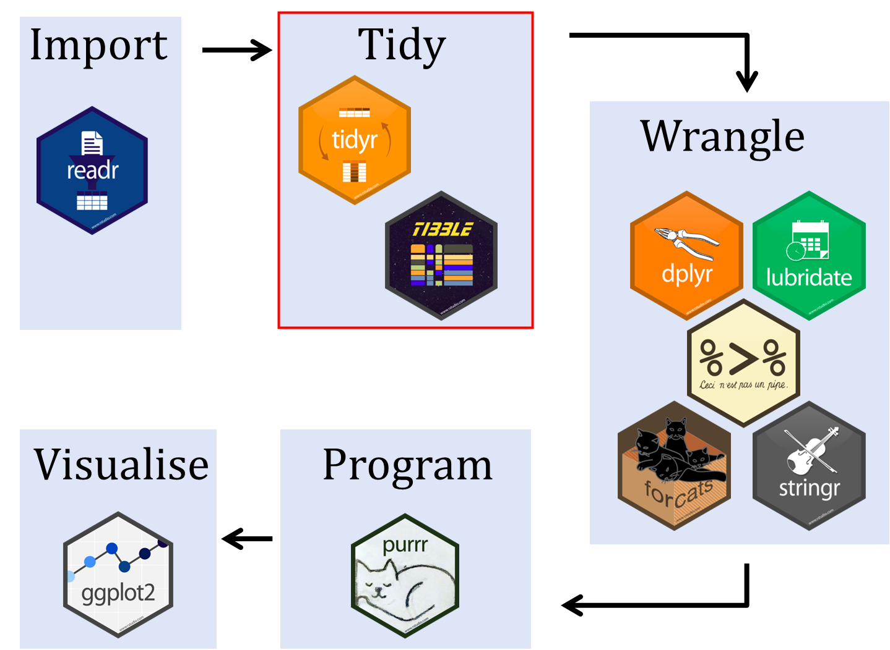
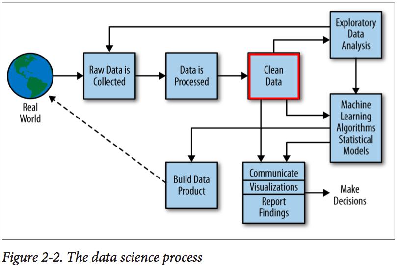
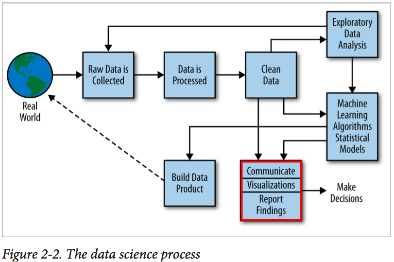
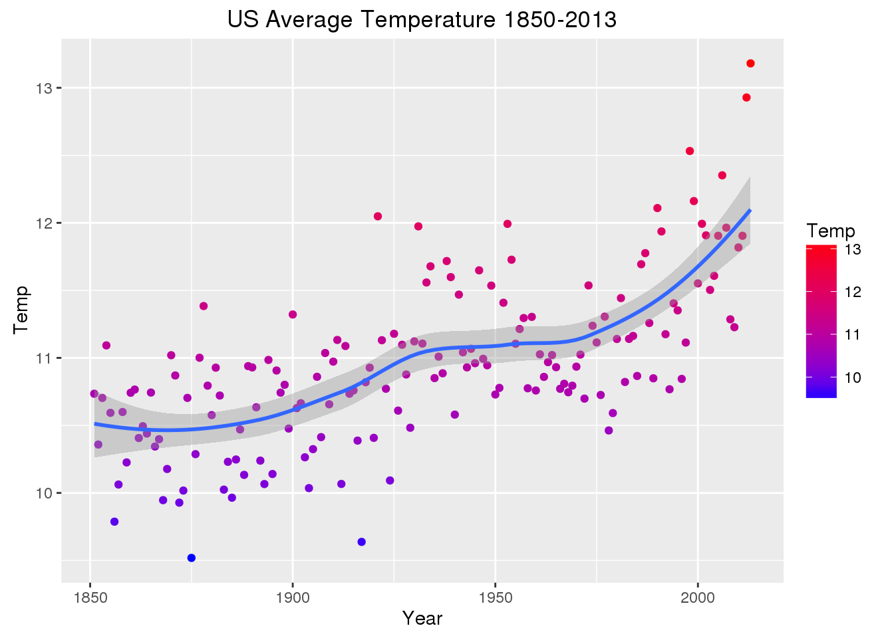
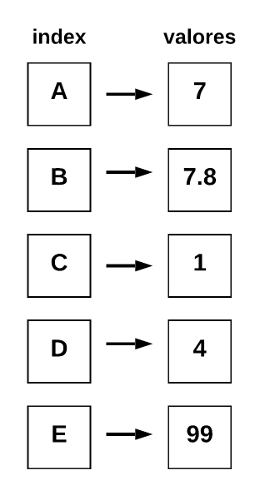
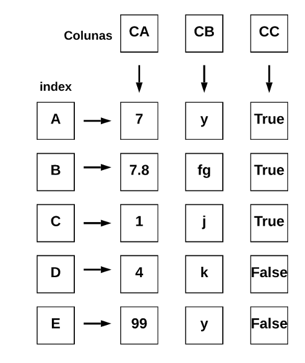
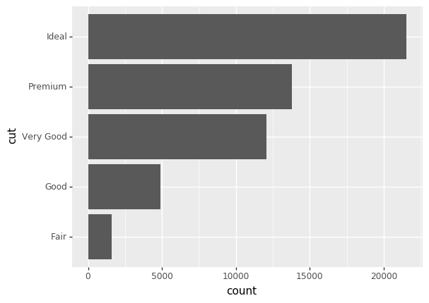

```{r setup, include=FALSE, cache=FALSE}
# set working directory to docs folder
# setwd(here::here("docs"))

# Set global R options
options(htmltools.dir.version = FALSE, servr.daemon = TRUE)

# Set global knitr chunk options
knitr::opts_chunk$set(
  fig.align = "center", 
  cache = TRUE,
  error = FALSE,
  message = FALSE, 
  warning = FALSE, 
  collapse = TRUE 
)

library(tidyverse)
# This is good for getting the ggplot background consistent with
# the html background color
library(ggplot2)
thm <- theme_bw()
theme_set(thm)
```

```{r, echo=FALSE}
# Configurando reticulate
library(reticulate)
reticulate::use_python("/home/felipe/anaconda3/bin/python")
```

class: title-slide   
<a href="https://github.com/dataAt/intro-analise-de-dados-apresentacao" class="github-corner" aria-label="Código no Github"><svg width="80" height="80" viewBox="0 0 250 250" style="fill:#fff; color:#151513; position: absolute; top: 0; border: 0; right: 0;" aria-hidden="true"><path d="M0,0 L115,115 L130,115 L142,142 L250,250 L250,0 Z"></path><path d="M128.3,109.0 C113.8,99.7 119.0,89.6 119.0,89.6 C122.0,82.7 120.5,78.6 120.5,78.6 C119.2,72.0 123.4,76.3 123.4,76.3 C127.3,80.9 125.5,87.3 125.5,87.3 C122.9,97.6 130.6,101.9 134.4,103.2" fill="currentColor" style="transform-origin: 130px 106px;" class="octo-arm"></path><path d="M115.0,115.0 C114.9,115.1 118.7,116.5 119.8,115.4 L133.7,101.6 C136.9,99.2 139.9,98.4 142.2,98.6 C133.8,88.0 127.5,74.4 143.8,58.0 C148.5,53.4 154.0,51.2 159.7,51.0 C160.3,49.4 163.2,43.6 171.4,40.1 C171.4,40.1 176.1,42.5 178.8,56.2 C183.1,58.6 187.2,61.8 190.9,65.4 C194.5,69.0 197.7,73.2 200.1,77.6 C213.8,80.2 216.3,84.9 216.3,84.9 C212.7,93.1 206.9,96.0 205.4,96.6 C205.1,102.4 203.0,107.8 198.3,112.5 C181.9,128.9 168.3,122.5 157.7,114.1 C157.9,116.9 156.7,120.9 152.7,124.9 L141.0,136.5 C139.8,137.7 141.6,141.9 141.8,141.8 Z" fill="currentColor" class="octo-body"></path></svg></a><style>.github-corner:hover .octo-arm{animation:octocat-wave 560ms ease-in-out}@keyframes octocat-wave{0%,100%{transform:rotate(0)}20%,60%{transform:rotate(-25deg)}40%,80%{transform:rotate(10deg)}}@media (max-width:500px){.github-corner:hover .octo-arm{animation:none}.github-corner .octo-arm{animation:octocat-wave 560ms ease-in-out}}</style>

<br><br><br><br>
# .font200[Introdução à análise de dados] 

<br><br>
### Adriano Pereira, Felipe Carvalho & Felipe Menino
### Setembro 2020

---
# Agenda

<br><br>


- .font120[Introdução ao R `r anicon::faa("r-project", animate = 'float', speed = 'slow', color = 'steelblue')`]

  - .font120[Tidyverse `r anicon::cia("./images/2_r_img/logo_tidyverse_menor.png", animate = 'float', speed = 'slow')`]

- .font120[Introdução ao Python `r anicon::faa("python", animate = 'float', speed = 'slow')`]

  - .font120[Pandas `r anicon::cia("./images/python/pandas-logo-300.png",  animate = 'float', speed = 'slow')`]

- .font120[Visualização de dados `r anicon::cia("./images/2_r_img/ggplot2_logo_menor.jpeg", animate = 'float', speed = 'slow')`]

<br>

---
class: title-slide

<br><br><br>
# .center.font170[Introdução ao .bold[R]]
---

# História do R

.font120[
**R** é uma linguagem de programação de alto nível com ambiente voltado para visualização e análise de dados. Em essência foi inspirada na linguagem de programação **S**. Foi iniciamente escrita por **R**oss Ihaka e **R**obert Gentleman no departamento de estatística da universidade de Auckland.
]

.pull-left[

```{r fig2, echo=FALSE, out.height="50%", out.width="50%"}
knitr::include_graphics("./images/2_r_img/robert_gentleman.jpg")
```

.center.font70[Robert Gentleman]

]

.pull-right[

```{r fig1, echo=FALSE, out.height="45%", out.width="45%"}
knitr::include_graphics("./images/2_r_img/ross_lhaka.jpeg")
```

.center.font70[Ross Ihaka]

]

---

class: title-slide
<br><br><br>

# .center.font170[Conceitos básicos]

---

# Conceitos básicos

## Atribuimos valor usando uma seta .bold[`<-`] apontada para a variável

<br>


.pull-left[

.bold.center.font100[Declaração de variáveis]

```{r, fig.height=4}
  inteiro <- 321L

  numerico <- 123
  
  complexo <- 321i
  
  booleano <- TRUE 
  
  caractere <- "Bem-vindos"

``` 

]

--
.pull-right[
.bold.center.font100[Acessando os valores]

```{r, fig.height=4}
  print(numerico)

  caractere
```
]


---

# Tipos de dados estruturados

### Podemos declarar um vetor usando .bold[`c()`] e uma lista usando .bold[`list()`]

.pull-left[

.bold.center.font100[Vetores]

```{r, fig.height=4}
  vetor_int <-   c(1, 3, 5)

  vetor_char <- c("teste", "teste", "teste")
  
  vetor_bool <- c(TRUE, TRUE, FALSE)
``` 


```{r, fig.height=5}
  vetor_int
``` 

]

.pull-right[

.bold.center.font100[Listas]

```{r, fig.height=5}
  lista_int <-   list(1, 3, 5)

  lista_lista <- list(1, 2.3, list("tres"))
``` 


```{r, fig.height=5, cache=FALSE}
  lista_lista
``` 

]

---

# Qual é a diferença?


.pull-left[

.bold[Vetores são atômicos, só aceitam um tipo:]

```{r, fig.height=5}
  vetor_diferente <- c(1, 2.5, TRUE, "ola")
  
  vetor_diferente
```

```{r, fig.height=5}
  is.atomic(vetor_diferente)
```

]

.pull-right[

.bold[Lista não são atômicas, aceitam diversos tipos:]

```{r, fig.height=5}
  lista_diferente <- list(1, TRUE, "ola")
  lista_diferente
```

```{r, fig.height=5}
  is.atomic(lista_diferente)
```
]


---

# Hierarquia de tipo primitivos

### O .bold[R] possui uma conversão de tipos, sendo assim, garantindo que todo vetor seja atômico.

.center[
```{r fig3, echo=FALSE, out.height="80%", out.width="80%"}
knitr::include_graphics("./images/2_r_img/tipos.png")
```
R 4 Data Science - Hadley
]


---

# Hierarquia de tipo primitivos

.pull-left[
### Os tipos mais fortes são:
.blue[
.font120[
1. character
2. complex
3. numeric
4. logical
]]]
.pull-right[
#### Conversão:

```{r}
v1 <- c(FALSE, "tipo", 5)
```
]

---

# Hierarquia de tipo primitivos

.pull-left[
### Os tipos mais fortes são:
.blue[
.font120[
1. character
2. complex
3. numeric
4. logical]]
]


.pull-right[
#### Conversão:

```{r}
v1 <- c(FALSE, "tipo", 5)
v1
```
]


---

# Hierarquia de tipo primitivos

.pull-left[
### Os tipos mais fortes são:
.blue[
.font120[
1. character
2. complex
3. numeric
4. logical]]
]


.pull-right[
#### Conversão:

```{r}
v1 <- c(FALSE, "tipo", 5)
v1
```

```{r}
v2 <- c(32, 1, 5i)
```

]

---

# Hierarquia de tipo primitivos

.pull-left[
### Os tipos mais fortes são:
.blue[
.font120[
1. character
2. complex
3. numeric
4. logical]]
]


.pull-right[
#### Conversão:

```{r}
v1 <- c(FALSE, "tipo", 5)
v1
```

```{r}
v2 <- c(32, 1, 5i)
v2
```
]


---

# Hierarquia de tipo primitivos

.pull-left[
### Os tipos mais fortes são:
.blue[
.font120[
1. character
2. complex
3. numeric
4. logical]]
]


.pull-right[
#### Conversão:

```{r}
v1 <- c(FALSE, "tipo", 5)
v1
```

```{r}
v2 <- c(32, 1, 5i)
v2
```

#### Tipos:
```{r}
typeof(v1)
```

```{r}
typeof(v2)
```
]

---

class: title-slide
<br><br><br>

# .center.font170[Data Frame]

<!-- ToDo: A palavra `Data Frame` não é tudo junto ? Tipo `DataFrame` ? -->
---
# Data Frame

.font120[Matriz composta por linhas e colunas, cujas colunas representam as variáveis (atributos) e as linhas representam observações]

<br>

.center[
```{r fig311, echo=FALSE, out.height="60%", out.width="60%"}
knitr::include_graphics("./images/2_r_img/df_definicao.png")
```
]

---
# Data Frame

.font120[Matriz composta por linhas e colunas, cujas colunas representam as variáveis (atributos) e as linhas representam observações]

.pull-left[
.center.font100[Podemos criar um dataframe usando .bold[data.frame()]]

```{r, fig.height=5}
    meu_df <- data.frame(
      nome=c("Ana", "João"),
      idade=c(23, 24),
      cargo=c("Cientista", "Analista")
      )
  meu_df
```

]

.pull-right[
.center.font100[Acessando os atributos]

```{r, fig.height=5}
  meu_df$nome
```


.center.font100[Tipo]

```{r, fig.height=5}
  typeof(meu_df)
```


.center.font100[Classe]

```{r, fig.height=5}
  class(meu_df)
```

]


---
# Estrutura de decisão

.pull-left[

.font120[O .bold[.blue[if]] do .bold[R] é bem parecido com o do .bold[Java]]

```{r}
  valor_a <- 21
  valor_b <- 42
  
  if(valor_a < valor_b){ 
    print("Valor A menor do que o valor B")
  } else if(valor_a == valor_b){
    print("Valor A é igual ao valor B")
  } else {
    print("Valor A é maior do que o valor B")
  }
```
]

--

.pull-right[

.font120[Dica]

```{r, fig.height=5}
    ifelse(42 > TRUE, "Verdade universal", "Fake news")
```
]

---

# Estrutura de repetição


.font110[Por outro lado, o .bold[.blue[for]] do .bold[R] parece com a sintaxe do .bold[Python]]

```{r, fig.height=5}
  meu_vetor <- c(1, 2, 3)
  
  for(i in meu_vetor){
    print(i)
  }
```
---

class: title-slide

<br><br><br><br>
# .center.font170[Tidyverse `r anicon::cia("./images/2_r_img/logo_tidyverse.png", animate = 'float', speed = 'slow')`]

---

# Tidyverse

.pull-left[

.center.font110[Conjunto de pacotes em R para ciência de dados]

```{r fig5, echo=FALSE, out.height="100%", out.width="100%"}
knitr::include_graphics("./images/2_r_img/tidy_workflow.png")
```
.center.font50[http://www.seec.uct.ac.za/r-tidyverse]

]

--

.pull-right[

.center.font110[Processo de ciência de dados]

```{r fig11, echo=FALSE, out.height="100%", out.width="100%"}
knitr::include_graphics("./images/2_r_img/data-science-process.png")
```

.center.font50[Doing Data Science - Rachel Schutt]


]

---

# Tidyverse

.pull-left[

.center.font110[Conjunto de pacotes em R para ciência de dados]

```{r fig51, echo=FALSE, out.height="100%", out.width="100%"}

```
.center.font50[http://www.seec.uct.ac.za/r-tidyverse]

]

.pull-right[

.center.font110[Processo de ciência de dados]

```{r fig112, echo=FALSE, out.height="100%", out.width="100%"}
knitr::include_graphics("./images/2_r_img/data-science-process_1.png")
```

.center.font50[Doing Data Science - Rachel Schutt]
]

---

# Tidyverse

.pull-left[

.center.font110[Conjunto de pacotes em R para ciência de dados]

```{r fig52, echo=FALSE, out.height="100%", out.width="100%"}
knitr::include_graphics("./images/2_r_img/tidy_workflow_2.png")
```
.center.font50[http://www.seec.uct.ac.za/r-tidyverse]

]

.pull-right[

.center.font110[Processo de ciência de dados]

```{r fig113, echo=FALSE, out.height="100%", out.width="100%"}

```

.center.font50[Doing Data Science - Rachel Schutt]
]

---

# Tidyverse

.pull-left[

.center.font110[Conjunto de pacotes em R para ciência de dados]

```{r fig54, echo=FALSE, out.height="100%", out.width="100%"}
knitr::include_graphics("./images/2_r_img/tidy_workflow_3.png")
```
.center.font50[http://www.seec.uct.ac.za/r-tidyverse]

]

.pull-right[

.center.font110[Processo de ciência de dados]

```{r fig114, echo=FALSE, out.height="100%", out.width="100%"}

```

.center.font50[Doing Data Science - Rachel Schutt]
]
---

# Leitura e escrita de dados - .bold[readr]

.pull-left[
.center.font120[Leitura]


```{r, fig.height=5, message=TRUE}
  library(readr)
  
  # Leitura dos dados
  star_wars <- 
    readr::read_csv(file = "data/starwars.csv")
```

]

.pull-right[
.center.font120[Escrita]

```{r, fig.height=5}
  # escrita 
  readr::write_csv(x = star_wars,
                   path = "data/dado.csv")
```

]
---

# Manipulação de dados - .bold[dplyr]

Para manipular nosso dataframe, vamos usar o pacote .blue[dplyr]. Métodos básicos:

.center[
```{r fig116, echo=FALSE, out.height="70%", out.width="70%"}
knitr::include_graphics("./images/2_r_img/dplyr_verbs.jpg")
```

.center.font80[R for Data Science - Garrett Grolemund]
]

---

# Seleção e Filtro


.pull-left[

.font120[Para facilitar a seleção dos atributos e tirar .bold[.blue[$]], vamos usar o .bold[.blue[select()]]]:

```{r, message=FALSE}
  library(dplyr)

  selecao <- 
    dplyr::select(star_wars, name, hair_color)
  
  head(selecao, 3)
```
]


.pull-right[

.font120[Para filtrar por um valor específico, usamos .bold[.blue[filter()]]]:

```{r, cache=FALSE}
  filtro <- 
    dplyr::filter(star_wars, species == "Droid" & skin_color == "gold")
  
  filtro
```
]

---

# Agrupamento e agregação

.pull-left[
.font120[Para criar grupos usamos a função .bold[.blue[group_by()]]]
```{r}
  agrupamento <- 
    dplyr::group_by(star_wars, species)
  
  head(agrupamento, 3)
```
]

.pull-right[
.font120[Para criarmos uma agregação do nosso agrupamento, usamos .bold[.blue[summarise()]] e para ordenarmos .bold[.blue[arrange()]]]:
```{r}
  media_grupo <- 
    dplyr::summarise(agrupamento, 
                     media = mean(height, na.rm = TRUE)) 
  
  media_grupo_order <- 
    dplyr::arrange(media_grupo, desc(media))

  head(media_grupo_order, 3)
```
]
---
# Transformação de atributos

.font120[Para criar/transformar novos atributos, usa-se .bold[.blue[mutate()]]]:

```{r}
  # conversão de cm para metros
  star_wars <- 
  dplyr::mutate(star_wars, height = height/100)
  
  head(star_wars, 3)
```
---

# Aplicando os métodos
<!-- ToDo: Acho que estes códigos todos juntos não estão limpos, podia criar uns bloquinhos separados para um conjunto de dois códigos para cada bloco, ou algo assim tlg -->


.pull-left[

.font120[Seleção]
```{r}
  selecao <- 
    dplyr::select(star_wars, -hair_color, -mass)

```

.font120[Filtro]
```{r}
  filtro <- 
    dplyr::filter(selecao, eye_color == "blue")
```

.font120[Agrupamento]

```{r}
  agrupamento <- 
    dplyr::group_by(filtro, species)
```


]

.pull-right[

.font120[Agregação]

```{r}
  media_grupo <- 
    dplyr::summarise(agrupamento, media = mean(height, na.rm = TRUE)) 
    
```

.font120[Ordenação]

```{r}
  media_grupo_order <- 
     dplyr::arrange(media_grupo, desc(media))
```


```{r, echo=FALSE}
   head(media_grupo_order, 3)
```

]


---

# Facilitando a vida com o operador .bold[pipe] (.bold[%>%])

.font120[O .bold[.blue[pipe]] passa a resposta da primeira atribuição para o primeiro parâmetro da função seguinte]:


```{r}
  library(magrittr)

  media_grupo <- star_wars %>%
    dplyr::select(-hair_color, -mass) %>%
    dplyr::filter(eye_color == "blue") %>%
    dplyr::group_by(species) %>%
    dplyr::summarise(media = 
                       mean(height, na.rm = TRUE)) %>%
    dplyr::arrange(desc(media))
```

```{r}
     head(media_grupo, 2)
```

---

# Facilitando a vida com o operador .bold[pipe] (.bold[%>%])

.pull-left[
.center.font120[Sem pipe]

```{r}
  # Seleção
  selecao <-
    dplyr::select(star_wars, -hair_color, -mass)

  # Filtro 
  filtro <- 
    dplyr::filter(selecao, eye_color == "blue")
  
  # Agrupamento
  agrupamento <- 
    dplyr::group_by(filtro, species)
  
  # Agregação
   media_grupo <- 
    dplyr::summarise(agrupamento, 
                     media = mean(height, na.rm = TRUE)) 
  
  # Ordenação 
   media_grupo_order <- 
     dplyr::arrange(media_grupo, desc(media))

```
]

.pull-right[
.center.font120[Com pipe]

```{r, message=FALSE}
   media_grupo <- star_wars %>%
    dplyr::select(-hair_color, -mass) %>%
    dplyr::filter(eye_color == "blue") %>%
    dplyr::group_by(species) %>%
    dplyr::summarise(media = 
                       mean(height, na.rm = TRUE)) %>%
    dplyr::arrange(desc(media))
```
]

---

class: title-slide
<br><br><br>

# .center.font170[Exemplo de análise de dados]

---

# Exemplo de análise de dados

Dado de série temporal da [temperatura da superfície terrestre](https://www.kaggle.com/berkeleyearth/climate-change-earth-surface-temperature-data)

```{r fig6, echo=FALSE, out.height="60%", out.width="60%"}

```
.center.font70[Fonte: Berkeley Earth]
---
# Exemplo de análise

```{r}
  # Leitura dos dados de mudança climática
  temperature_countries <-
  readr::read_csv("./data/GlobalLandTemperaturesByCountry.csv")

  # Leitura e seleção dos dados de continentes
  continent <- 
    readr::read_csv("./data/countryContinent.csv") %>%
    dplyr::select(country, continent) # Seleção do atributo continente
```

```{r}
  head(temperature_countries, 2)
```

```{r}
  tail(temperature_countries, 2)
```

---
# Exemplo de análise


.pull-left[

.center.font110[Filtro a partir do ano 2000 e extração da média anual]

```{r}
  year_temperature <- temperature_countries %>%
    dplyr::filter(dt > "2000-01-01")  %>% 
    dplyr::mutate(dt = lubridate::year(dt)) %>% 
    dplyr::group_by(Country, dt) %>% 
    dplyr::summarise(year_mean = mean(AverageTemperature)) 
```

```{r, echo=FALSE}
  head(year_temperature, 3)
```


]

.pull-right[

.center.font110[Junção dos continentes com cada país]

```{r}
  continent_temperature <- year_temperature %>% 
    dplyr::rename(country = Country) %>%
    dplyr::left_join(continent, by="country") %>% 
    dplyr::filter(!is.na(continent))  
```

```{r, echo=FALSE}
  head(continent_temperature, 3)
```
]

<!-- ToDo: Achei que estes textos ficaram muito grudados na parte de baixo da apresentação, o que acha ? -->
--
.center.font80[.bold[

Qual o continente que registrou a maior temperatura anual?

Qual o ano com a maior média de temperatura registrada?]]

---

# Exemplo de análise

.pull-left[

.center.font80[.bold[Qual o continente que registrou a maior temperatura anual?]]

```{r}
  continent_temperature %>%
  dplyr::group_by(continent) %>% 
  summarise(maior_temp = max(year_mean, na.rm = TRUE)) 
```
]

.pull-right[

.center.font80[.bold[Qual foi o ano com a maior média de temperatura registrada??]]

```{r}
  continent_temperature %>%
    dplyr::group_by(dt, continent) %>%
    dplyr::summarise(maior_temp = max(year_mean, na.rm = TRUE)) %>%
    dplyr::arrange(desc(maior_temp)) %>%
  head(5)
```

]

<!-- Fim da parte do R-->

---
class: title-slide

<br><br><br><br>
# .center.font170[[Hands-on](https://www.kaggle.com/oldlipe/intro-ds-r-worcap2020) `r anicon::faa("hand-paper", animate = 'float', speed = 'slow')`]

<!-- Inicio da parte de Python-->
---

class: title-slide
<br><br>

# .center.font170[Introdução ao Python]
---
# Introdução ao Python

<br><br><br>
.font130[
Python é uma linguagem multiparadigma, com uma sintaxe muito simples que permite ao programador focar no problema e deixar de lado questões da linguagem.
]

<br><br>

---
class: title-slide

<br><br><br><br>
# .font170[Comandos básicos da linguagem] 


---
# Comandos básicos da linguagem

.pull-left[

  ### Declarações de variáveis

  ```{python}
  inteiro = 123
  flutoante = 1.1234
  booleano = True
  lista = [1, 2, 3, 4, 5]
  dicionario = {'chave': 'valor'}
  string = 'Um texto legal'
  ```
]

.pull-right[
  ### Manipulação simples!

  ```{python}
  dicionario['chave']
  lista[0:3] 
  flutoante += 1 
  # 1.1234
  ```
]

---
# Estrutura de controle de decisão

As estruturas de controle de decisão facilitam o controle do fluxo que o código está tomando, representando parte importante da linguagem

.pull-left[
### if

```{python}
if (2 > 1):
  print("Dois é maior que um!")
```

### else

```{python}
if (2 < 1):
  print('Dois é menor que um')
else:
  print('Dois é maior que um')
```

]

.pull-right[

<br>

### elif

```{python}
if (1 > 1):
  print('Um é maior que um')
elif(1 > 0.5):
  print('Um é maior que meio')
```
]

---
# Estrutura de repetição

Essas são estruturas que permitem a criação de laços, havendo facilmente repetição de um certo bloco de código, e ainda, permite iterações em estruturas de dados como as listas

.pull-left[
  ### while
  
  ```{python}
  i = 0
  while i < 5:
    print(i)
    i += 1
  ```
]

.pull-right[
  ### for-each
  .pull-left[
    ```{python}
    for i in [1, 2, 3]:
      print(i)
    ```
  ]
  .pull-right[
    ```{python}
    for i in range(0, 3):
      print(i)
    ```
  ]
]

---
class: title-slide

<br><br><br><br>
# .center[.font170[Pandas] `r emo::ji("panda_face")`]

---
# Pandas `r emo::ji("panda_face")`

<br><br><br>
.font130[
Pandas é uma biblioteca open source, licenciada pelo BSD, que fornece estruturas de dados de alto desempenho e fáceis de usar e ferramentas de análise de dados para a linguagem de programação Python.
]

<br>

.bold[Para importar a biblioteca, utilize:]

```{python}
import pandas as pd
```

---
class: title-slide

<br><br><br><br>
# .font170[Estruturas de dados básicas do Pandas] 

---
# Estruturas de dados básicas do Pandas

.pull-left[
  ### Series
  
  - Estruturas unidimensionais;
    - Dados armazenados em linhas
  - Índice nas linhas;
  - Suporte a qualquer tipo de dados;
  - Exemplo de aplicação: Séries Temporais
] 

.pull-right[
  <div style = "position:relative; left:160px; top: 60px;">
    </img>
  </div>
]

---
# Estruturas de dados básicas do Pandas

.center[
.content-box-gray[.bold[Exemplos de utilização das Series]]
]

.pull-left[
  ### Criando uma Series simples
  ```{python}
  series = pd.Series([1, 2]) 
  print(series)
  ```
  
  ### Series com índice
  ```{python}
  series = pd.Series([1, 2], [9, 'ultimo'])
  print(series)
  ```
]

.pull-right[
  ### Recuperando valores

  A recuperação dos dados é muito parecida com as encontradas em dicionários (chave-valor).
  
  ```{python}
  print(series[9])
  print(series["ultimo"])
  ```
  
  ```{python}
  dicionario = {"Nome": "Maria"}
  print(dicionario["Nome"])
  ```
]

---
# Estruturas de dados básicas do Pandas

.pull-left[
  ### DataFrames
  
  - Estruturas multidimensionais;
    - Dados armazenados em linhas e colunas.
  - Índice nas linhas e colunas;
  - Suporte a qualquer tipo de dados (Um diferente para cada coluna).
] 

.pull-right[
  <div style = "position:relative; right:30px; top: -20px;">
    </img>
  </div>
]

---
# Estruturas de dados básicas do Pandas

.center[
  .content-box-gray[.bold[Exemplos de utilização dos DataFrames]]
]

.pull-left[
  #### Criando um DataFrame básico
  
  ```{python}
  df = pd.DataFrame([[1, 2, 3, 4], [11, 12, 13, 14]])
  print(df)
  ```
  
  #### DataFrame com índice
  ```{python}
  df = pd.DataFrame([[1, 2, 3, 4], [11, 12, 13, 14]], 
                      index = ['um', 'dois'])
  print(df)
  ```
]

.pull-right[
  #### Índices e colunas
  
  ```{python}
  df = pd.DataFrame([[1, 2, 3, 4], [11, 12, 13, 14]], 
                    index = ['um', 'dois'], 
                    columns = ['a', 'b', 'c', 'd'])
  print(df)
  ```
  
  #### Recuperando valores
  
  .pull-left[
    ```{python}
    print(df['b']['um'])
    ```
  ]
  
  .pull-right[
    ```{python}
    print(df['a']['dois'])
    ```
  ]
]

---
class: title-slide

<br><br><br><br>
# .font140[Manipulação básica de dados com Pandas] 

<!-- No slide após este, inserir uma figura mostrando o processo de manipulação dos dados. (Pegando de uma tabela completa e entendendo somente uma parte, filtro e etc...) -->

---
# Manipulação básica de dados com Pandas

O pandas fornece uma infinidade de métodos para a seleção e filtro dos dados. Sendo todos úteis para o processo de análise de dados com Python

--
## loc e iloc

Para iniciar, os métodos `loc` e `iloc` podem ser bastante utilizados para tais processos.

<br><br>
.center[
  | DataFrame                                  | Series                  |
  |--------------------------------------------|-------------------------|
  | \.loc[Nome da linha,  Nome da coluna]   | \.loc[Posição da linha] |
  | \.iloc[posição da linha, posição da coluna] | \.iloc[Nome da linha] |
]

---
# Manipulação básica de dados com Pandas

.center[
  .content-box-gray[.bold[Exemplo de utilização do loc e iloc]]
]

.pull-left[
  ### DataFrame de exemplo
  
  ```{python}
  df = pd.DataFrame({
    'nome': ['Joana', 'Maria', 'Josefa'],
    'idade': [15, 18, 21],
    'nota': [8, 9, 10]
  }, index = [7, 8, 9])
  ```

  Recuperando a linha de `nome` 9 e a coluna de nome `idade`.
  
  ```{python}
  print(df.loc[9, 'idade'])
  ```
]

.pull-right[
  É possível também recuperar mais de uma coluna ao mesmo tempo
  
  ```{python}
  print(df.loc[9, ['nome', 'idade']])
  ```
  
  Para recuperar as posições, utilize o `iloc`.
  
  ```{python}
  print(df.iloc[2][['nome', 'idade']])
  ```
]

---
# Filtro de dados

.center[
  .font135[Para muitas partes da análise de dados, realizar filtros e buscas é de extrema importância. No Pandas há diversos métodos que podem ser aplicados.]
]

.pull-left[
  #### DataFrame de exemplo
  
  ```{python}
  df = pd.DataFrame({
    'nome': ['A1', 'A2', 'A3', 'A4'], 'valor': [5, 12, 8, 30]
  })
  ```
  
  #### filter

  Filtra os dados pelo nome da coluna
  
  ```{python}
  df.filter(items = ['valor'])
  ```
]

.pull-right[
  <br><br>
  Filtrando os dados por uma coluna que contenha no nome a palavra `lo`.
  
  ```{python}
  df.filter(like='lo', axis = 1)
  ```
]

---
# Filtro de dados

.pull-left[
  #### Indexação booleana

  É possível fazer o filtro de dados com um índice booleano

  ```{python}
  df[[False, True, False, True]]
  ```
  
  A indexação pode ser feita de forma automática, com uma comparação lógica
  ```{python}
  df[df['valor'] > 10]
  ```
]
  
.pull-right[
  <br><br>
  Criando expressões mais `complexas`
  ```{python}
  df[(df['valor'] >= 5) & (df['valor'] < 12)]
  ```
  
  As mesmas consultas podem ser realizadas com o método `query()`.
  ```{python}
  df.query('valor >= 5 & valor < 12')
  ```
]

---
# Filtro de dados

.center[
  .content-box-gray[.bold[Dica: Filtragem e substituição (where)]]
]

<br>

```{python}
df_2 = df.copy()
df_2[df_2['valor'] > 10] = -99; print(df_2)
```

Uma forma mais elegante, trabalhando com `where`
```{python}
df.where(df['valor'] < 10, -99)
```

---
# Agrupamento e agregação

<br><br><br>
.font130[
Agrupar dados ajuda na análise dos dados, é através deste processo que técnicas de análise exploratória de dados e estatística descritiva podem ser feitos. Para tais atividades, utilizam-se os agrupamentos e agregações.
]

---
# Agrupamento e agregação

<br>
.font130[
Agregações são operações aplicadas sobre os dados que resultam em um conjunto de valores
]

<br>

.content-box-gray[.bold[Algumas funções de agregação]] `r anicon::faa("hand-point-left", animate="horizontal")`

- sum();
- max();
- min();
- mean().

---
# Agrupamento e agregação

.pull-left[
  ### Agregando `Series`

  ```{python}
  s = pd.Series([1, 2, 3])
  ```

  Calculando o somatório
  ```{python}
  s.sum()
  ```

  Valor mínimo
  ```{python}
  s.min()
  ```

]

.pull-right[
  ### Agregando `DataFrames`

  ```{python}
  df = pd.DataFrame([[1, 2, 3], [4, 5, 6]])
  ```

  Calculando o valor médio
  ```{python}
  df.mean()
  ```

  Valor máximo
  ```{python}
  df.max()
  ```
]

---
# Agrupamento e agregação

.center[
  No processo de agrupamento, os dados são agrupados com base em suas características. Para tal finalidade, o Pandas disponibiliza o método `groupby`.
]

.pull-left[
  ### Agrupando dados
  
  ```{python}
  df = pd.DataFrame({
    'nome': ['Tel1', 'Tel2', 'Tel3'],
    'tipo': ['antigo', 'novo', 'novo']
  })
  
  agrupado = df.groupby('tipo')
  ```
]

.pull-right[
  Tipo retornado
  
  ```{python}
  print(agrupado)
  ```
  
  Recuperando os grupos gerados
  ```{python}
  agrupado.groups
  ```
]

---
class: title-slide

<br><br><br><br>
# .center[.font170[Agrupamento + Agregação = ] `r  anicon::faa("trophy", animate="tada")`]

---
# Agrupamento + Agregação

<br>

.center[
  
]

---
# Agrupamento + Agregação

.center[
  .content-box-gray[.bold[Exemplo de utilização de agrupamento com agregação]]
]

.pull-left[
  ```{python}
  df = pd.DataFrame({
    'nome': ['ana', 'maria', 'felipe', 'joão'],
    'idade': [19, 19, 20, 20],
    'dinheiro': [150, 150, 100, 100]
  })
  ```
  
  Agrupando pela `idade` e contando os elementos
  
  ```{python}
  # Esta é a etapa de divir, da definição do Hedley
  agrupado = df.groupby('idade')
  
  ## Esta é a etapa de aplicação e junçaõ, definida pelo Hedley
  print(agrupado.count())
  ```
]

.pull-right[
  Média de dinheiro por idade
  
  ```{python}
  agrupado['dinheiro'].mean()
  ```
  
  A idade que recebe mais dinheiro
  
  ```{python}
  agrupado['dinheiro'].sum()
  ```
]

---
class: title-slide

<br><br><br><br>
# .center[.font170[Leitura de dados] `r  anicon::faa("book", animate="vertical")`]

---
# Leitura de dados

.center[
  Com o Pandas é possível não só realizar o processamento dos dados, mas também a leitura e escrita destes. A biblioteca suporta diversos formatos, sendo alguns deles `CSV`, `JSON` e `Excel`.
]

.pull-left[
  ### Carregando arquivo `CSV`
  ```{python}
  data = pd.read_csv("data/titanic.csv", sep = ',')
  ```

  Os dados carregados convergem para `Series` e `DataFrames`.

  ```{python}
  type(data)
  ```
]

.pull-right[
  ### Salvando os dados em `CSV`

  ```{python}
  data.to_csv('data/resultados.csv')
  ```
]

---
class: title-slide
<br><br><br>

# .center.font170[Exemplo de análise de dados]

---
# Exemplo de análise de dados

[Dados de 45 mil meteoritos](https://www.kaggle.com/nasa/meteorite-landings) que cairam na Terra, publicados pela NASA.

.pull-left[
  Carregando os dados
  ```{python}
  import pandas as pd
  
  data = pd.read_csv("data/meteorite-landings.csv")
  type(data)
  ```
  
  Verificando os atributos dos dados. A descrição de cada atributo está disponível na [página dos dados](https://www.kaggle.com/nasa/meteorite-landings)
  ```{python}
  data.columns
  ```
]

.pull-right[
  <br><br>
  Separando os dados por tipo de meteorito
  ```{python}
  df_valid = data[data['nametype'] == 'Valid']
  df_relict = data[data['nametype'] == 'Relict']
  ```
  
  Verificando as quantidades de cada tipo
  ```{python}
  print("Valid: {} | Relict: {}".format(
    df_valid.shape[0], df_relict.shape[0]
  ))
  ```
]

---
# Exemplo de análise de dados

.pull-left[
  <br><br><br>
  Verificando a massa média de cada tipo de meteorito
  ```{python}
  df_groupby_nametype = data.groupby('nametype')
  df_groupby_nametype['mass'].mean()
  ```
]

.pull-right[
  <br>
  Façamos a contagem dos tipos de meteoritos
  ```{python}
  df_groupedby_recclass = data.groupby('recclass')
  df_groupedby_recclass['recclass'].count().head(n = 3)
  ```
  
  Por fim, façamos o filtro do conjunto de dados pela quantidade de massa
  
  ```{python}
  # Filtragem (Maior que 500 gramas)
  df_gt_mass_500 = data[data['mass'] > 500]
  df_gt_mass_500.shape # Quantidade bem menor
  ```
]

---
class: title-slide

<br><br><br><br>
# .center.font170[[Hands-on](https://www.kaggle.com/phelpsmemo/intro-ds-python-worcap2020) `r anicon::faa("hand-paper", animate = 'float', speed = 'slow')`]

---
class: title-slide

<br><br>

# .center[.font170[Visualização de dados] `r  anicon::faa("chart-bar", animate="tada")`]

---
# Pacotes de visualização

## As bibliotecas de visualização de dados `ggplot2` e `plotnine` são baseadas na obra .bold[The Grammar of Graphics], a qual apresenta uma grámatica para elaboração de gráficos. Tal gramática é composta por camadas, as quais descrevem os componentes do gráfico.

.pull-left[

.center.font110[Camadas de componentes gráficos]

```{r fig612, echo=FALSE, out.height="70%", out.width="70%"}
knitr::include_graphics("./images/2_r_img/ggplot-2.png")
```

]

--

.pull-right[

.center.font110[Sintaxe do ggplot/plotnine]

```{r, eval=FALSE}
   ggplot(data = <DATA>, aes(<MAPPINGS>)) + 
    <GEOM_FUNCTION>(
      mapping = aes(<MAPPINGS>),
      stat = <STAT>,
      position = <POSITION>) +
    <COORDINATE_FUNCTION> +
    <FACET_FUNCTION>
```

]

---
# Mapeamento estético

### A estética descreve cada aspecto de um dado elemento gráfico. Descrevemos as posições (`position`) por um valor x e y, mas outros sistemas de coordenadas são possíveis. É possível alterar a forma (`shape`), tamanho (`size`) e cor (`size`) dos elementos. 

.center[
```{r fig63, echo=FALSE, out.height="80%", out.width="80%"}
knitr::include_graphics("./images/2_r_img/aes_ggplot.png")
```
.center.font80[Fundamentals of Data Visualization - Claus O. Wilke]
]
---
# Objetos geométricos
.center[
```{r fig64, echo=FALSE, out.height="38%", out.width="38%"}
knitr::include_graphics("./images/2_r_img/ggplot.png")
```

.center.font60[Fundamentals of Data Visualization - Claus O. Wilke]
]

---
# Exemplo com R - Gráfico de dispersão

.pull-left[

.center.font100[Mapeamento estético]

```{r, fig.height=5, fig.width=7}
  library(ggplot2)

  ggplot(iris, aes(x = Petal.Width, y = Petal.Length, color = Species))
```
]

--

.pull-right[

.center.font100[Objeto geométrico]

```{r, fig.height=5, fig.width=7}
  ggplot(iris, aes(x = Petal.Width, y = Petal.Length, color = Species)) + 
  geom_point() 
```
]

---
# Exemplo com R - Gráfico de colunas

.pull-left[

.center.font100[Mapeamento estético e objeto geométrico]

```{r, fig.height=5, fig.width=7}
ggplot(data = diamonds) + 
  stat_count(mapping = aes(x = cut))
```

]

--
.pull-right[
.center.font100[Sistema de coordenadas]

```{r, fig.height=5, fig.width=7}
ggplot(data = diamonds) + 
  stat_count(mapping = aes(x = cut)) + 
  coord_flip()
```

]


---
# Exemplo com Python - Gráfico de dispersão

.pull-left[

.center.font100[Mapeamento estético]

```{python, eval=FALSE}
from plotnine import *
from plotnine.data import mtcars, diamonds

ggplot(mtcars, aes(x = 'mpg', y = 'disp'))
```
  
```{r fig66, echo=FALSE, out.height="85%", out.width="85%"}
knitr::include_graphics("./images/python/ggplot_1.png")
```
  
]

--

.pull-right[

.center.font100[Objeto geométrico]

  ```{python, eval = FALSE}
  (ggplot(mtcars, aes(x = 'mpg', y = 'disp', color = 'factor(am)'))
      + geom_point())
  ```
  
```{r fig67, echo=FALSE, out.height="100%", out.width="100%"}
knitr::include_graphics("./images/python/ggplot_2.png")
```
  
]

---
# Exemplo com Python - Gráfico de colunas

.pull-left[

.center.font100[Mapeamento estético e objeto geométrico]

  ```{python, fig.height=5, fig.width=7, eval=FALSE}
  (ggplot(data = diamonds) + 
    stat_count(mapping = aes(x = 'cut')))
  ```
  
```{r fig68, echo=FALSE, out.height="85%", out.width="85%"}
knitr::include_graphics("./images/python/ggplot_3.png")
```

]

--
.pull-right[
.center.font100[Sistema de coordenadas]

  ```{python, fig.height=5, fig.width=7, eval=FALSE}
  (ggplot(data = diamonds) + 
      stat_count(mapping = aes(x = 'cut')) + 
      coord_flip())
  ```
  
```{r fig69, echo=FALSE, out.height="85%", out.width="85%"}

```
]

---
class: title-slide

<br><br>

# .center[.font170[Indo além]`r  anicon::faa("rocket", animate="tada")`]

---

# Exemplo - Gráfico de coordenadas paralelas

.pull-left[

<br><br><br>

```{r, fig.height=4, fig.width=7, eval=FALSE}
  iris %>% dplyr::mutate(id = 1:nrow(iris)) %>% 
    tidyr::gather(atributos, valores, -Species, -id) %>% 
    ggplot(., aes(x = atributos, y = valores, color = Species, group = id)) + 
  geom_line(size=0.55) +
  labs(x       = "Atributos",
       y       = "Valores", 
       title   = "Coordenadas Paralelas - Iris",
       caption = "Fonte: dataAt") + 
    theme_bw() +
    theme(plot.title = element_text(hjust= 0.5, margin = margin(b = 7))) 
```

]

.pull-right[

```{r, fig.height=6, fig.width=8, eval=TRUE, echo=FALSE}
  iris %>% dplyr::mutate(id = 1:nrow(iris)) %>% 
    tidyr::gather(atributos, valores, -Species, -id) %>% 
    ggplot(., aes(x = atributos, y = valores, color = Species, group = id)) + 
  geom_line(size=0.55) +
  labs(x       = "Atributos",
       y       = "Valores", 
       title   = "Coordenadas Paralelas - Iris",
       caption = "Fonte: dataAt") + 
    theme_bw() +
    theme(plot.title = element_text(hjust= 0.5, margin = margin(b = 7))) 
```

]
---
# Exemplo - Gráfico de coordenadas paralelas

.pull-left[

<br><br><br>

```{r, fig.height=6, fig.width=7, eval=FALSE}
  iris %>% dplyr::mutate(id = 1:nrow(iris)) %>%
    tidyr::gather(atributos, valores, -Species, -id) %>%
    ggplot(., aes(x = atributos, y = valores, color = Species, group = id)) + 
    geom_line(size=0.55) +
    facet_grid(~Species) + 
    labs(x     = "Atributos",
         y     = "Valores", 
         title = "Coordenadas Paralelas - Iris") +
    theme_bw() + 
    theme(plot.title = element_text(hjust= 0.5, margin = margin(b = 7)), axis.text.x = element_text(angle = 90)) 
```

]

.pull-right[
```{r, fig.height=6, fig.width=8, echo=FALSE, eval=TRUE}
  iris %>% dplyr::mutate(id = 1:nrow(iris)) %>%
    tidyr::gather(atributos, valores, -Species, -id) %>%
    ggplot(., aes(x = atributos, y = valores, color = Species, group = id)) + 
    geom_line(size=0.55) +
    facet_grid(~Species) + 
    labs(x     = "Atributos",
         y     = "Valores", 
         title = "Coordenadas Paralelas - Iris") +
    theme_bw() + 
    theme(plot.title = element_text(hjust= 0.5, margin = margin(b = 7)), axis.text.x = element_text(angle = 90)) 
```

]

---
class: title-slide
<br><br>


.center.font300[Extensões do ggplot] <br> .center.font200[(Somente em R)]
---
# Lemon package
```{r, echo=FALSE}
  library(lemon)
  
  # Definição da semente para garantir reprodutibilidade
  set.seed(123)
  
  # amostragem dos dados
  amost <- sample(c(1:nrow(diamonds)), nrow(diamonds)*0.1, replace = FALSE)
  amost_diam <- diamonds[amost,]
```

.pull-left[

<br><br><br>

```{r, fig.height=4, fig.width=7, eval=FALSE}
amost_diam %>%
  ggplot(., aes(x = as.factor(cut), y = price, color = clarity)) + 
  geom_point(position=position_jitter(width=0.08)) + 
  coord_flex_cart(bottom=brackets_horisontal(), left=capped_vertical('both')) +
  theme_light() +
  theme(panel.border=element_blank(), axis.line = element_line(),
        plot.title = element_text(hjust= 0.5, margin = margin(b = 7))) + 
  labs(x     = "Qualidade do corte",
       y     = "Preço em US",
       title = "Gráfico de bolhas - Diamonds")
```
]

.pull-right[
```{r, fig.height=6, fig.width=7, eval=TRUE, echo=FALSE}
 amost_diam %>%
    ggplot(., aes(x = as.factor(cut), y = price, color = clarity)) + 
    geom_point(position=position_jitter(width=0.08)) + 
    coord_flex_cart(bottom=brackets_horisontal(), left=capped_vertical('both')) +
    theme_light() +
    theme(panel.border=element_blank(), axis.line = element_line(),
          plot.title = element_text(hjust= 0.5, margin = margin(b = 7))) + 
    labs(x     = "Qualidade do corte",
         y     = "Preço em US",
         title = "Gráfico de bolhas - Diamonds")
```
]

---

class: title-slide
<br><br>


.center.font300[Obrigado!]


<!-- Fim da parte de visualização-->